# NAZ Order Papers System Architecture

This document presents the implemented architecture. Mermaid-capable Markdown
viewers render each diagram graphically.

## 1. System Context

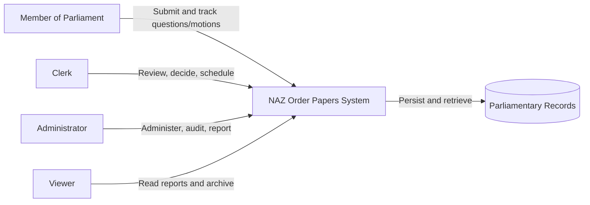

## 2. Container Architecture

```mermaid
flowchart TB
    subgraph Browser["User Browser"]
        UI["React 18 UI\nNext.js App Router pages"]
        STORE["Zustand auth state\nReact context"]
    end

    subgraph Next["Next.js 14 Container :3000"]
        MW["JWT middleware\nRoute navigation guard"]
        SSR["Server layouts/pages"]
        BFF["/api/* route handlers\nBackend-for-frontend proxy"]
        COOKIE["HTTP-only naz_token cookie"]
    end

    subgraph API["FastAPI Container :8000 / host :8080"]
        ROUTERS["API routers\nAuth, records, submissions,\nreviews, reports, audit"]
        DEPS["Auth and permission dependencies"]
        SERVICES["Domain services\nStatus, visibility, RBAC,\nsimilarity, archiving"]
        SCHEMAS["Pydantic request/response schemas"]
        ORM["SQLAlchemy ORM"]
    end

    subgraph Data["PostgreSQL 16 + pgvector :5432 / host :5433"]
        REL[(Relational tables)]
        VECTOR[(vector(384) + cosine index)]
    end

    UI <--> STORE
    UI -->|Same-origin fetch /api/*| BFF
    MW <--> COOKIE
    SSR <--> COOKIE
    BFF <--> COOKIE
    BFF -->|JSON + Bearer JWT| ROUTERS
    ROUTERS --> DEPS
    ROUTERS --> SCHEMAS
    ROUTERS --> SERVICES
    SERVICES --> ORM
    ROUTERS --> ORM
    ORM --> REL
    SERVICES --> VECTOR
```

## 3. Layer Responsibilities

| Layer | Implemented responsibility |
| --- | --- |
| Browser pages/components | Forms, tables, filters, permission-aware controls, feedback, and navigation. |
| Next.js middleware | Fast local JWT check before protected page navigation. |
| Next.js BFF | Reads HTTP-only cookie, forwards Bearer JWT, normalizes backend errors. |
| FastAPI routers | HTTP contracts, dependency injection, orchestration, status codes, audit calls. |
| Domain services | Status transitions, record visibility, RBAC seed/mapping, similarity merge, archiving. |
| Pydantic schemas | Input validation and typed response serialization. |
| SQLAlchemy models | Entity mappings and relationships. |
| PostgreSQL | Durable users, sessions, records, workflow, search, review, and audit data. |
| pgvector | Optional semantic similarity storage and cosine matching. |

## 4. Authentication Sequence

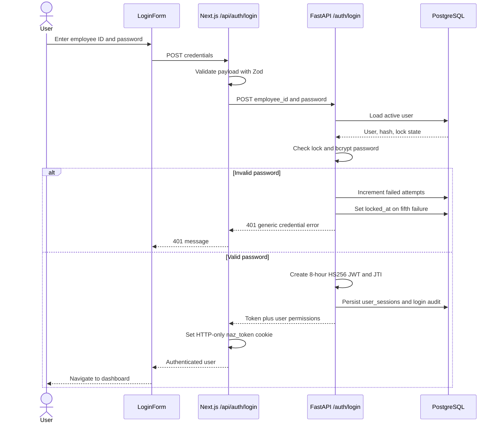

## 5. Protected Request Sequence

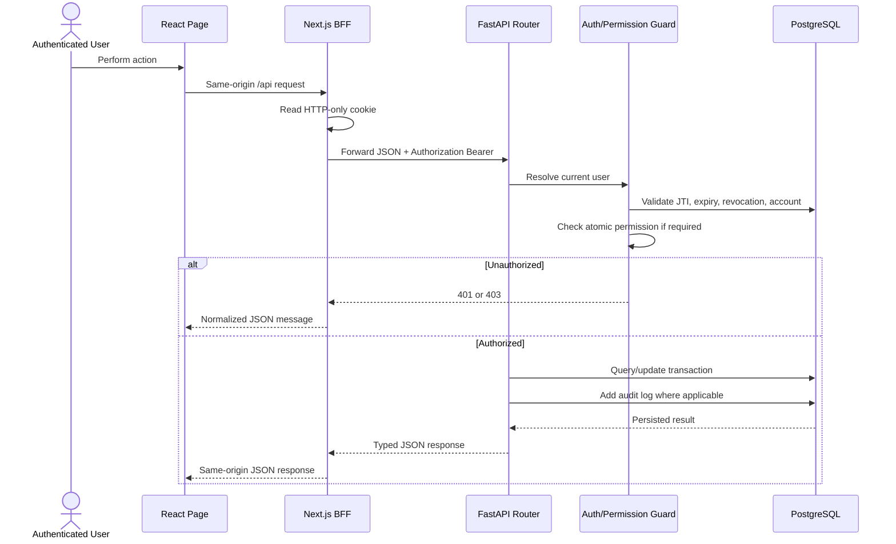

## 6. Submission and Review Flow

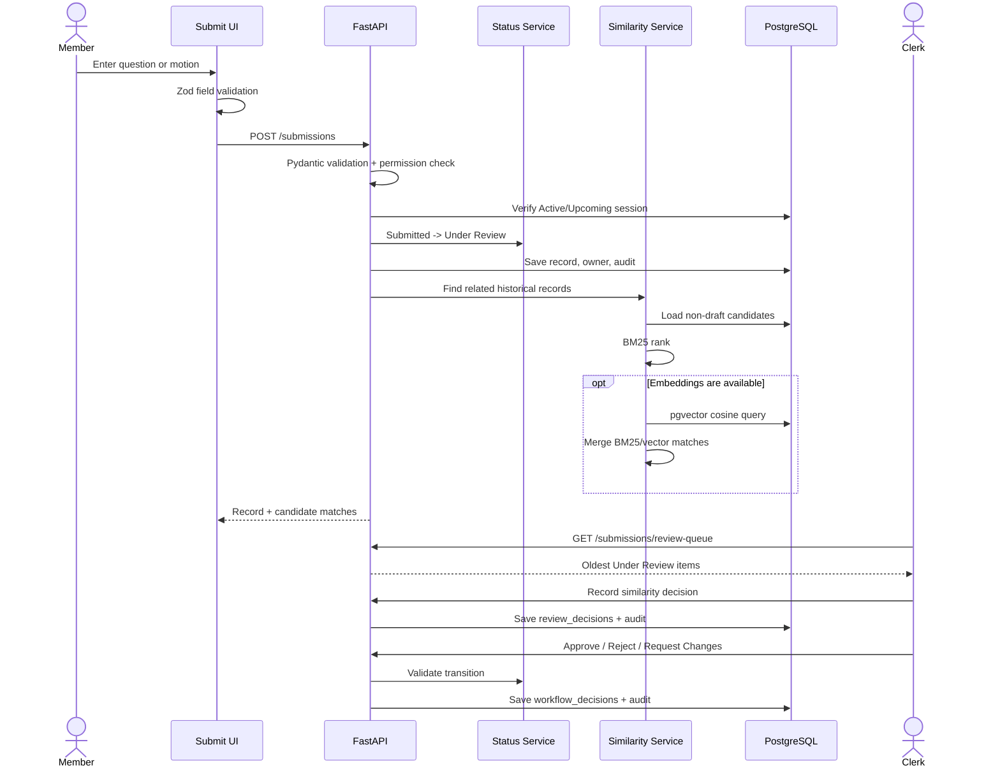

## 7. Submission State Machine

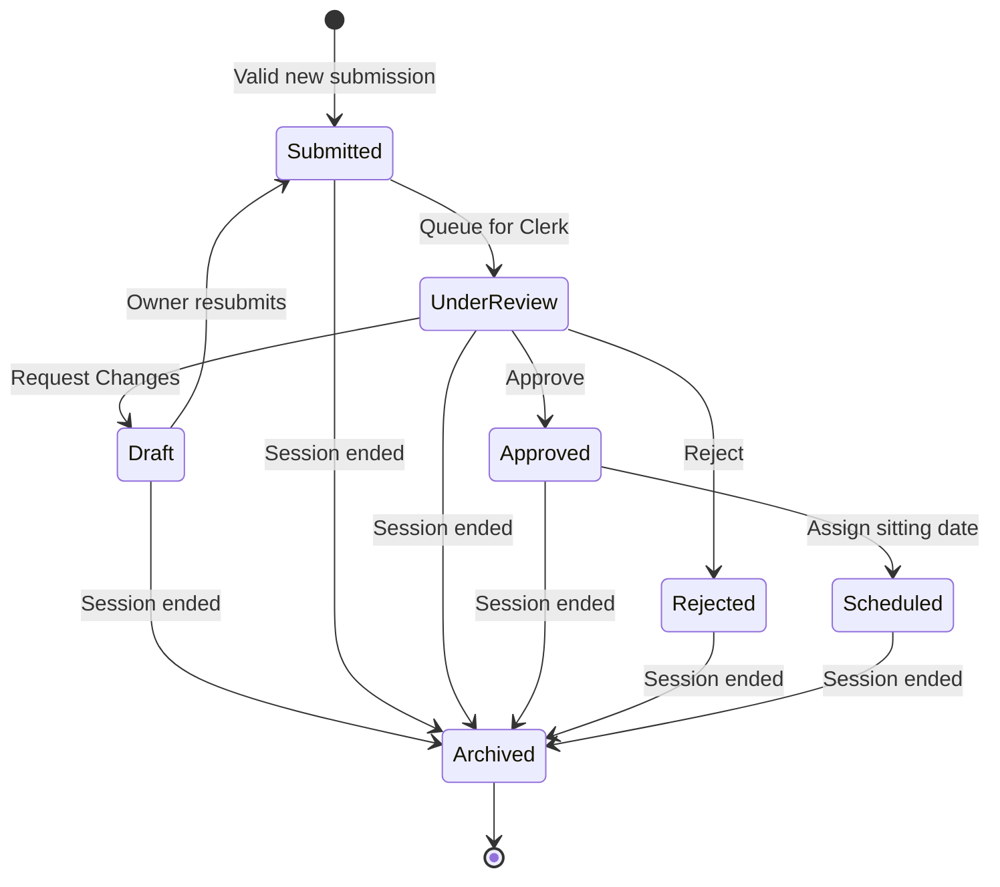

`UnderReview` in the diagram corresponds to the stored value `Under Review`.
Transitions not shown are rejected.

## 8. Scheduling and Order Paper Flow

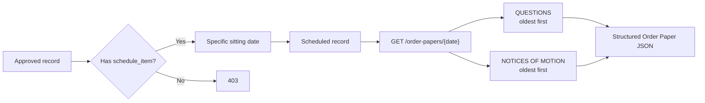

## 9. Search Architecture

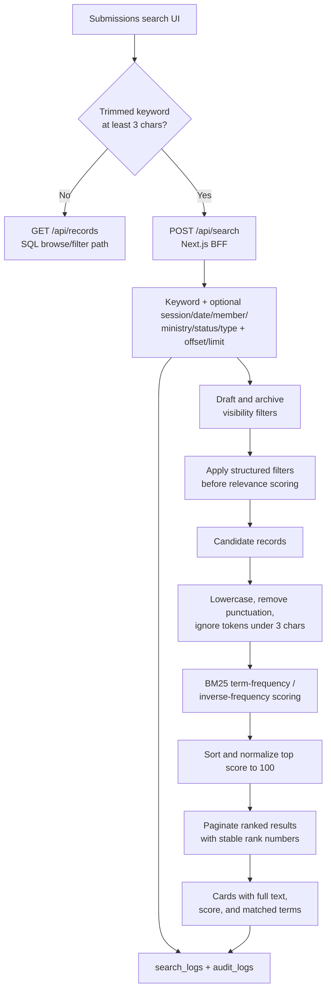

The record-list endpoint uses SQL filters and partial text matching for blank or
short-keyword browsing. Usable keywords take the BM25 branch so matching content,
not only record metadata, determines relevance.

## 10. Archive Flow

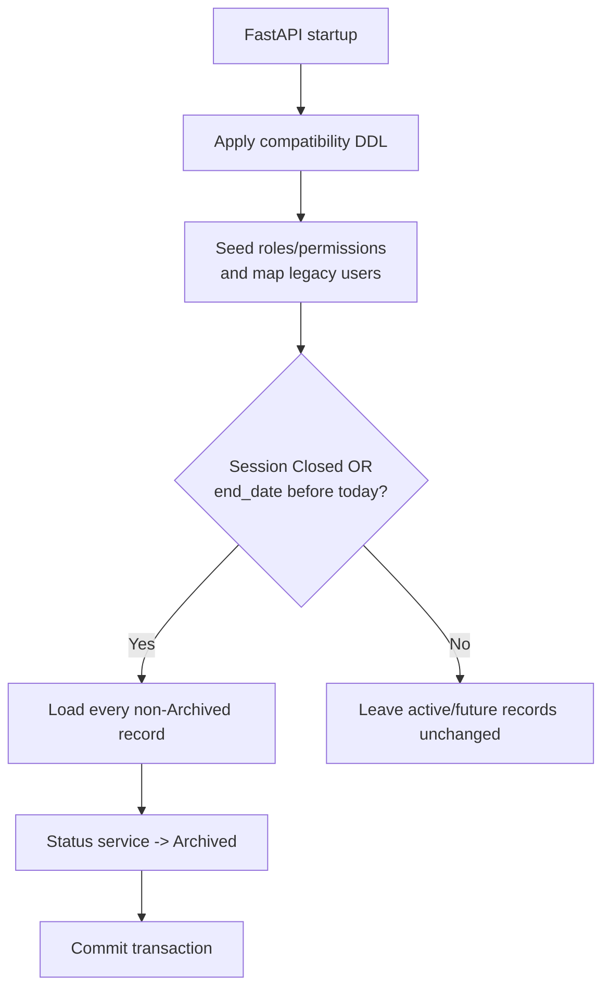

## 11. Entity Relationship Diagram

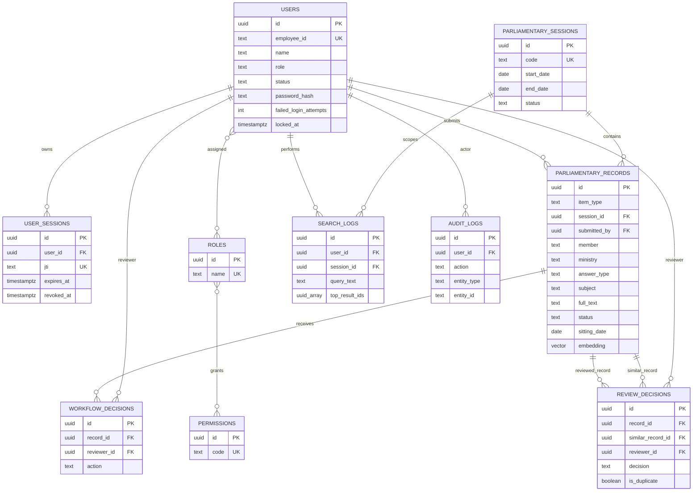

The physical join tables `user_roles` and `role_permissions` implement the two
many-to-many relationships.

## 12. Docker Deployment

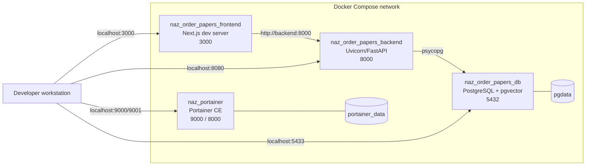

## 13. Trust Boundaries

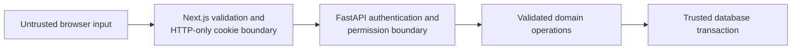

Important controls at the boundaries:

- Zod validates login and forms in the browser/BFF.
- Pydantic is authoritative for API payload validation.
- The BFF prevents direct browser access to the JWT.
- FastAPI revalidates JWT session state and permissions.
- SQLAlchemy uses parameterized statements.
- PostgreSQL constraints protect core enumerations and references.

## 14. Source Map

- Full behavioral contract: [system-specification.md](system-specification.md)
- Every tracked file: [file-guide.md](file-guide.md)
- Delivery and verification status: [implementation-report.md](implementation-report.md)
- Local startup: [../README.md](../README.md)
