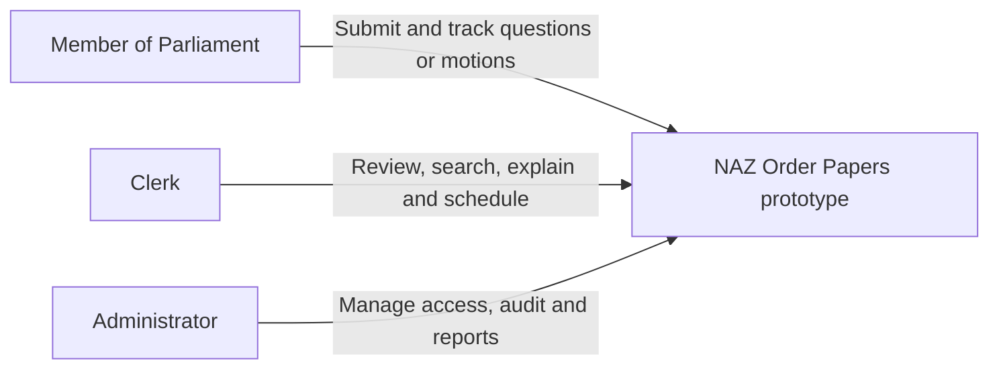
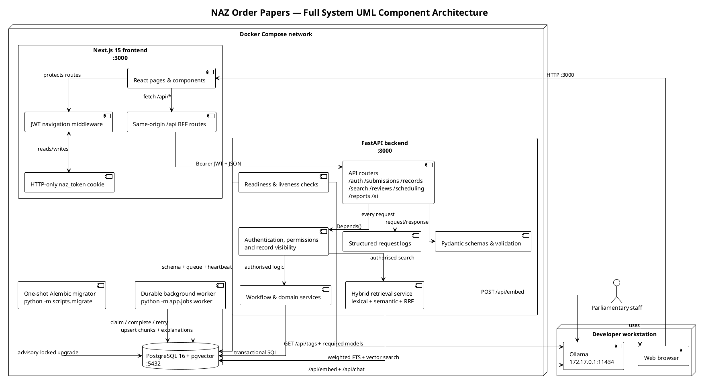
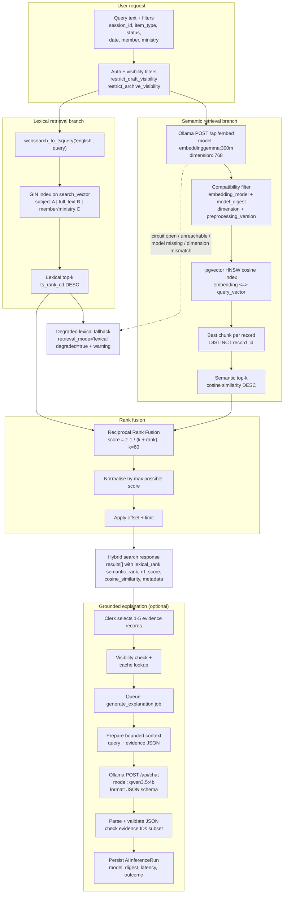
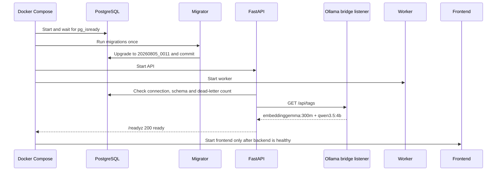
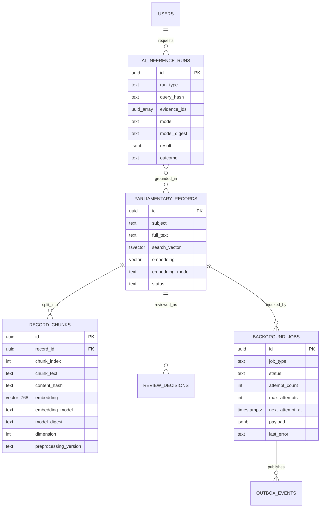

# NAZ Order Papers System Architecture

This document describes the implemented prototype as of 5 August 2026. It has
two authoritative views:

1. the complete application and container architecture; and
2. the hybrid retrieval-augmented generation (RAG) architecture.

The diagrams use Mermaid. A PlantUML component definition is also included for
teams that maintain UML documentation separately.

## 1. System context



The AI layer is advisory. It retrieves evidence and can generate a grounded
explanation, but a human clerk retains every procedural decision.

## 2. Full system UML component architecture

```mermaid
flowchart TB
    ACTORS[Parliamentary staff]

    subgraph HOST[Developer workstation]
        BROWSER[Web browser]
        OLLAMA[Ollama service\nembeddinggemma:300m + qwen3.5:4b\nDocker bridge 172.17.0.1:11434]
    end

    subgraph COMPOSE[Docker Compose network]
        subgraph FRONTEND[Next.js 15 frontend :3000]
            UI[React pages & components]
            MW[JWT navigation middleware]
            BFF[Same-origin /api BFF routes]
            COOKIE[HTTP-only naz_token cookie]
        end

        subgraph BACKEND[FastAPI backend :8000 / host :8080]
            ROUTES[API routers\n/auth /submissions /records\n/search /reviews /scheduling\n/reports /ai]
            ACCESS[JWT session, permissions\nand record visibility]
            DOMAIN[Workflow & domain services]
            HYBRID[Hybrid retrieval service\nlexical + semantic + RRF]
            READY[Readiness & liveness checks]
            LOGS[Structured request logs]
            SCHEMAS[Pydantic schemas & validation]
        end

        MIGRATE[One-shot Alembic migrator\nadvisory lock + transaction]
        WORKER[Durable background worker\nleases + retry backoff + dead letter]

        subgraph POSTGRES[PostgreSQL 16 + pgvector :5432 / host :5433]
            DOMAINDB[(Domain, auth, workflow\nand audit tables)]
            FTS[(Weighted tsvector + GIN index)]
            VECTORS[(record_chunks vector(768)\n+ HNSW cosine index)]
            QUEUE[(background_jobs + outbox_events)]
            HEARTBEAT[(worker_heartbeats)]
            INFERENCE[(ai_inference_runs)]
        end
    end

    ACTORS --> BROWSER
    BROWSER -->|HTTP :3000| UI
    UI --> MW
    MW <--> COOKIE
    UI --> BFF
    BFF -->|Bearer JWT + JSON| ROUTES
    ROUTES --> ACCESS
    ACCESS --> DOMAIN
    ACCESS --> HYBRID
    ROUTES --> LOGS
    ROUTES --> SCHEMAS
    DOMAIN --> DOMAINDB
    HYBRID --> FTS
    HYBRID --> VECTORS
    HYBRID -->|POST /api/embed| OLLAMA
    READY --> DOMAINDB
    READY -->|GET /api/tags| OLLAMA
    READY --> QUEUE
    READY --> HEARTBEAT
    MIGRATE --> DOMAINDB
    WORKER --> QUEUE
    WORKER --> HEARTBEAT
    WORKER --> VECTORS
    WORKER --> INFERENCE
    WORKER -->|POST /api/embed + /api/chat| OLLAMA
```

### Component responsibilities

| Component | Responsibility |
| --- | --- |
| Next.js frontend | Pages, forms, tables, permission-aware controls and same-origin API proxying. |
| FastAPI routers | Typed HTTP contracts, authentication dependencies, orchestration and audit calls. |
| Domain services | Workflow transitions, visibility, scheduling, reporting and archive behavior. |
| Hybrid retrieval service | PostgreSQL lexical retrieval, Ollama query embedding, pgvector semantic retrieval and RRF fusion. |
| PostgreSQL | System of record, search indexes, vector chunks, inference audit, durable queue and recovery authority. |
| Worker | Claims durable jobs, creates embeddings and explanations, reports heartbeat, retries failures and surfaces dead letters. |
| Ollama | Local-only embedding and structured explanation inference; no cloud model API is used. |
| Readiness probe | Requires current schema, PostgreSQL, required Ollama models and zero dead-letter jobs before reporting ready. |

## 3. Full-system PlantUML source

A higher-fidelity UML component diagram is maintained in
[`diagrams/system-component.puml`](diagrams/system-component.puml). The inline
source below is a compact version for quick embedding.



## 4. Hybrid RAG system architecture

The public search contract supports `keyword` and `hybrid` modes. Hybrid is the
default. Semantic retrieval is an internal branch of hybrid mode rather than a
third public mode. A standalone, colour-coded version of this diagram is in
[`diagrams/ai-rag-pipeline.mmd`](diagrams/ai-rag-pipeline.mmd).



### Healthy live response shape

```json
{
  "retrieval_mode": "hybrid",
  "degraded": false,
  "warnings": [],
  "total_lexical": 1,
  "total_semantic": 6,
  "results": [
    {
      "lexical_rank": 1,
      "semantic_rank": 1,
      "metadata": {
        "subject": "Community Water Point Rehabilitation"
      }
    }
  ]
}
```

## 5. Indexing and recovery architecture

```mermaid
sequenceDiagram
    participant API as FastAPI
    participant DB as PostgreSQL
    participant W as Durable worker
    participant O as Ollama :11434

    API->>DB: Commit record + audit + outbox + embedding job
    W->>DB: Claim due job with FOR UPDATE SKIP LOCKED
    W->>DB: Read record version and content hash
    W->>W: Create deterministic overlapping chunks
    W->>O: POST /api/embed ordered batch
    O-->>W: 768-dimensional vectors
    W->>DB: Store record_chunks with model digest and chunks-v1

    alt Success
        W->>DB: completed; publish outbox event
    else Temporary failure
        W->>DB: retry at now + min(2^attempt, 3600s)
    else Attempts exhausted
        W->>DB: dead_letter + bounded error
        Note over DB: /readyz becomes not_ready and exposes dead_letter count
    end

    Note over W,DB: Manual recovery records reason, time and previous error,
    Note over W,DB: resets attempts, then requeues the same durable job.
```

Every non-draft record is eligible for chunk indexing. A compatible chunk is
identified by record, chunk index, content hash, model name, exact model digest,
dimension and preprocessing version. Stale or incompatible vectors are excluded
from retrieval.

## 6. Grounded explanation RAG flow

```mermaid
sequenceDiagram
    actor Clerk
    participant API as FastAPI AI router
    participant DB as PostgreSQL
    participant W as Durable worker
    participant LLM as Ollama qwen3.5:4b

    Clerk->>API: Select 1-5 retrieved evidence records
    API->>DB: Enforce review permission and record visibility
    API->>DB: Create/cache AI inference run + durable job
    API-->>Clerk: 202 queued or 200 cached
    W->>DB: Claim explanation job
    W->>LLM: Bounded query + evidence + JSON schema
    LLM-->>W: Structured classification and rationale
    W->>W: Validate IDs, enums and human-review requirement
    W->>DB: Persist result, model digest, latency and outcome
    Clerk->>API: Poll explanation run
    API-->>Clerk: Grounded advisory result; human review required
```

The LLM receives only the selected retrieved evidence. It cannot silently add
records, and its output cannot make or persist a parliamentary decision.

## 7. Startup and readiness sequence



`/livez` and `/health` only prove that the API process is alive. `/readyz` is
the traffic gate and returns HTTP 503 when PostgreSQL/schema is unavailable,
Ollama or its required models are unavailable, or any job is dead-lettered.

## 8. Search and AI data model



## 9. Network and trust boundaries

- Browser input is untrusted and validated again by FastAPI/Pydantic.
- The Next.js BFF keeps the JWT in an HTTP-only cookie and forwards it as a
  Bearer token.
- FastAPI validates persistent session state, permissions and row visibility.
- PostgreSQL queries are parameterized and enforce relational constraints.
- Ollama uses the standard port `11434` and is bound to Docker's bridge address,
  not the public LAN interface. Containers resolve it through
  `host.docker.internal`.
- The embedding model is `embeddinggemma:300m` with dimension 768. Semantic SQL
  only accepts chunks with the active exact model digest and preprocessing
  identity.
- Structured logs contain request IDs, routes, status codes and durations; they
  do not require Prometheus or OpenTelemetry for this prototype.

## 10. Source map

- AI implementation explanation: [ai-explanation.html](ai-explanation.html)
- As-built RAG architecture (HTML): [naive-rag-architecture.html](naive-rag-architecture.html)
- Full system UML component diagram (PlantUML): [diagrams/system-component.puml](diagrams/system-component.puml)
- AI RAG pipeline diagram (Mermaid): [diagrams/ai-rag-pipeline.mmd](diagrams/ai-rag-pipeline.mmd)
- System requirements: [system-specification.md](system-specification.md)
- Implementation status: [implementation-report.md](implementation-report.md)
- File guide: [file-guide.md](file-guide.md)
- Local startup and Ollama binding: [../README.md](../README.md)
